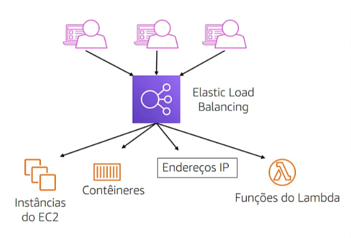
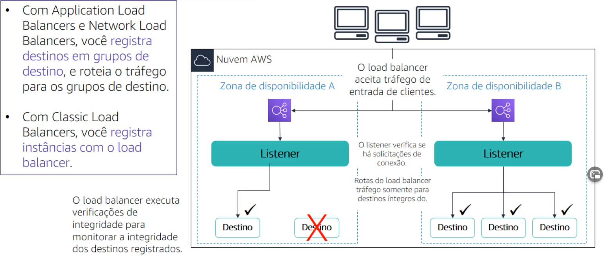

# Módulo 10

## Auto Scaling e monitoramento

### Seção 1 - Elastic Load Balancing

O Elastic Load Balancing **distribui o tráfego de entrada do aplicativo ou da rede entre vários destinos** em uma única zona de disponibilidade ou em várias zonas de disponibilidade. Ele escala seu load balancer à medida que o tráfego para seu aplicativo muda com o tempo.

  

Existem três tipos de load balancer:

- **Application Load Balancer**: opera no **nível do aplicativo ou na camada sete** do modelo OSI. Ele roteia o tráfego para destinos com base no conteúdo da solicitação. Ele é ideal para balanceamento avançado de carga de tráfego HTTP e HTTPS. Fornece roteamento avançado de solicitações direcionado para a entrega de arquiteturas de aplicativos modernas, incluindo microsserviços e contêineres.
- **Network Load Balancer**: opera no **nível de transporte ou na camada 4** do modelo OSI. Ele roteia o tráfego para os destino com base nos dados do protocolo IP. Pode acessar milhões de solicitações por segundo e ainda manter latências ultrabaixas. É otimizado para lidar com padrões de tráfego súbitos e voláteis. É ideal para o balanceamento de carga de tráfego TCP, UDP e TLS em que haja necessidade de uma performance excepcional.
- **Classic Load Balancer** (geração anterior): opera nas **camadas de aplicativo e transporte**. Faz o balanceamento de carga entre várias instâncias do EC2 e é ideal para o balanceamento de carga de tráfego HTTP, HTTPS, TCP e SSL.

Como o Elastic Load Balancing funciona:

Um load balancer aceita o tráfego de entrada dos clientes e roteia solicitações para seus destinos registrados em uma ou mais zonas de disponibilidade. Você pode configurar seu load balancer para aceitar o tráfego de entrada especificando um ou mais listeners. Um listener é um processo que verifica se há solicitações de conexão. 

  

**Casos de uso:**

- Aplicativos altamente disponíveis e tolerantes a falhas
- Aplicativos em contêineres
- Elasticidade e escalabilidade
- Virtual Private Cloud (VPC)
- Ambiente híbridos
- Invocar funções do Lambda por HTTP(S)

**Monitoramento do load balancer**:

- **Métricas do Amazon CloudWatch**: para verificar se o sistema está funcionando conforme o esperado e cria um alarme para iniciar uma ação se uma métrica sair de um intervalo aceitável.
- **Logs de acesso**: capture informações detalhadas sobre solicitações enviadas ao load balancer.
- **Logs do AWS CloudTrail**: capture quem, o que, quando e onde das interações de API nos serviços da AWS.

### Seção 2 - Amazon CloudWatch 

Para usar a AWS com eficiência, você precisa de informações sobre seus recursos da AWS. Você captura essas informações com o Amazon CloudWatch. Ele é um **serviço de monitoramento e observação** criado para engenheiros de DevOps, desenvolvedores, engenheiros de confiabilidade de sites e gerentes de TI.

O CloudWatch **monitora** os recursos e os aplicativos da AWS executados em tempo real na AWS. Você pode usar o CloudWatch para **coletar e monitorar métricas** que são as variáveis que é possível medir para avaliar seus recursos e aplicações. Também, você pode criar um **alarme** para monitorar qualquer métrica do Amazon CloudWatch em sua conta. Você também pode usar os **eventos** do Amazon CloudWatch para definir regras que correspondam a eventos de entrada ou alterações no seu ambiente da AWS e roteá-los para destinos para processamento.

### Seção 3 - Amazon EC2 Auto Scaling

Escalabilidade é a capacidade de aumentar ou diminuir a capacidade computacional de sua aplicação. Na nuvem, a capacidade computacional é um recurso programático. Isso significa que você pode adotar uma abordagem flexível para escalabilidade.

O Amazon EC2 Auto Scaling é um serviço da AWS que ajuda a manter a disponibilidade dos aplicativos e permite adicionar ou remover automaticamente instâncias do EC2 de acordo com as condições que você define. Ele detecta instâncias do EC2 danificadas e aplicativos não íntegros e substitui as instâncias sem sua intervenção. Também, fornece várias opções de escalabilidade - manual, programada, dinâmica ou sob demanda e preditiva.

Um **grupo de Auto Scaling** é um conjunto de instâncias do EC2 que são tratadas como um agrupamento lógico para fins de escalabilidade automática e gerenciamento.

