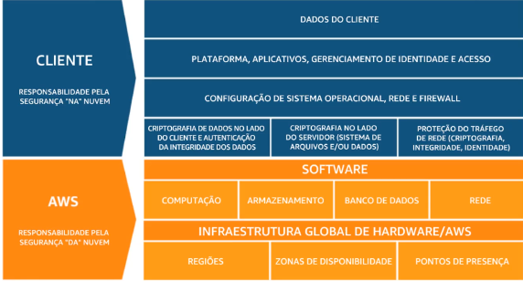

# Módulo 4

## Segurança na nuvem

### Seção 1 - Modelo de responsabilidade compartilhada da AWS

**Segurança e conformidade são responsabilidades compartilhadas entre a AWS e os clientes**. O modelo de responsabilidade compartilhada da AWS basicamente indica quais partes de segurança serão tratadas pela AWS e por quais partes os clientes são responsáveis.

	
  
  

**Podemos dizer que a AWS é responsável pela segurança da nuvem**. Assim, responsável por **tudo relacionado à implementação física**. É responsabilidade do **cliente usar as ferramentas para proteger seus dados e aplicativos**.

A AWS é responsável por proteger a segurança física dos datacenters e pela proteção da infraestrutura global que executa todos os serviços oferecidos pela Nuvem AWS. A infraestrutura global inclui regiões da AWS, zonas de disponibilidade e pontos de presença. A AWS também é responsável pela infraestrutura física que contém seus recursos, incluindo redundância e detecção de intrusão.

**Responsabilidade do Cliente**:

- O que implanta ao usar os serviços da AWS
- Proteger seus aplicativos e por definir seus grupos de segurança e configurações de rede adequadamente
- Gerenciar a segurança dos seus dados da AWS

**IaaS**: serviços em que você mantém o controle e o gerenciamento da maior parte do sistema. O cliente é responsável por gerenciar mais aspectos da segurança e configura os controles de acesso. EC2 é um IaaS.

**PaaS**: serviços que fazem uso da infraestrutura, mas ela é amplamente oculta da sua visão, assim, sendo gerenciada pelo provedor de nuvem. Você pode se concentrar no código e na implementação dos aplicativos. Amazon Relational Database Service pode ser caracterizado como PaaS.

**SaaS**: serviços que fornecem uma solução de software completa pronta para uso. O software é hospedado centralmente e o cliente não precisa gerenciar nenhuma infraestrutura que oferece suporte ao serviço. AWS Trusted Advisor e AWS Shield podem ser caracterizados como SaaS.

### Seção 2 - AWS Identity and Access Management (IAM)

Ao criar uma política de IAM, um usuário pode receber acesso ao Console de Gerenciamento da AWS e acesso programático.

 Uso o IAM para gerenciar o acesso aos recursos da AWS

- Um recurso é uma entidade em uma conta da AWS com a qual vocô pode trabalhar
- Exemplo de recursos: uma instância do Amazon EC2 ou um bucket do Amazon S3

Defina direitos de acesso refinados

- Quem pode acessar o recurso
- Quais recursos podem ser acessados e o que o usuário pode fazer com o recurso
- Como os recursos podem ser acessados

O IAM é um recurso de conta da AWS gratuito

**IAM: componentes essenciais**

- **Usuário do IAM**: uma **pessoa** ou **aplicativo** que pode se autenticar com uma conta da AWS
- **Grupo do IAM**: uma **coleção de usuários do IAM** que recebem autorização idêntica
- **Política do IAM**: o documento que define **quais recursos podem ser acessados** e o **nível de acesso** a cada recurso
- **Função do IAM**: mecanismo útil para conceder um conjunto de permissões para fazer solicitações de serviço da AWS

MFA significa autenticação multifator. Ela oferece maior segurança. Além do nome de usuário e da senha, a MFA requer um código de autenticação exclusivo para acessar os serviços da AWS.

Gerenciar o acesso aos recursos da AWS e definir direitos de acesso refinados são melhores práticas para proteger contas com o AWS IAM.

Somente o usuário raiz da conta da AWS pode alterar o plano do AWS Support.

### Seção 3 - Proteção de uma nova conta da AWS

Prática recomendada: não use o usuário raiz da conta da AWS, exceto quando necessário. Ele possui um acesso completo a todos os serviços da AWS. Em vez disso, a AWS recomenda que você use o Identity and Access Management para criar usuários e atribuir permissões a esses usuários. Também, é recomendado seguir o princípio do privilégio mínimo. 

### Seção 5 - Proteção de dados na AWS

**Criptografia de dados em repouso:**

- A criptografia codifica dados com uma chave secreta, o que os torna ilegíveis
- Somente quem tem a chave secreta pode decodificar os dados
- O **AWS KMS** pode gerenciar suas chaves secretas

- A AWS oferece suporte à criptografia de dados em repouso
- **Dados em repouso**: dados armazenados fisicamente em qualquer serviço compatível com o AWS KMS, incluindo:
  - Amazon S3
  - Amazon EBS
  - Amazon Elastic File System (Amazon EFS)
  - Bancos de dados gerenciados do Amazon RDS

**Criptografia de dados em trânsito:**

- Criptografia de **dados em trânsito** (dados em movimentação por uma rede)
  - **Transport Layer Security (TSL)** é um protocolo de padrão aberto
  - **AWS Certificate Manager** oferece uma maneira de gerenciar, implantar e renovar certificados TLS ou SSL
- O HTTP seguro (HTTPS) cria um túnel seguro
  - Ele usa TLS ou SSL para a troca bidimensional de dados
- Os serviços da AWS oferecem suporte à criptografia de dados em trânsito

**Proteção de buckets e objetos do Amazon S3**

- Os buckets e objetos do S3 recém-criados são privados e protegidos por padrão
- Quando os casos de uso exigem o compartilhamento de objetos de dados no Amazon S3:
  - É essencial gerenciar e controlar o acesso aos dados
  - Siga as permissões que respeitam o princípio do privilégio mínimo e considere o uso da criptografia do Amazon S3
- **Ferramentas e opções para controlar o acesso aos dados do S3** incluem:
  - Recurso Amazon S3 Block Public Acess
  - Políticas do IAM
  - Políticas de buckets
  - Listas de controles de acesso (ACLs)
  - Verificação de permissão de bucket do AWS Trusted Advisor

### Seção 6 - Trabalhar para garantir a conformidade

- Os clientes estão sujeitos a muitos regulamentos e requisitos diferentes de segurança e conformidade
- A AWS contrata órgãos de certificação e auditores independentes para fornecer aos clientes informações detalhadas sobre as políticas, os processos e os controles estabelecidos e operados pela AWS

Os **programas de conformidade** podem ser categorizados amplamente:

- Certificações e declarações
- Leis, regulamentos e privacidade
- Alinhamentos e estruturas

- **Lei de Portabilidade e Responsabilidade de Seguros de Saúde ou HIPAA**

**AWS Config :**

- É um serviço que você pode usar para **avaliar, auditar e avaliar a configuração de seus recursos da AWS**
- Mantém um **histórico da configuração** da AWS

**AWS Artifact:**

- Fornece **downloads sob demanda de documentos sobre segurança e conformidade da AWS**
-  Você pode enviar os documentos de segurança e conformidade aos auditores para demonstrar a segurança e a conformidade da infraestrutura e dos serviços da AWS
- Esses documentos também podem ser usados como diretrizes para avaliar sua própria arquitetura de nuvem e a eficácia dos controles internos da sua empresa

### Seção 4 - Proteção de Contas

**AWS Organizations:**

- É um serviço de gerenciamento de contas que permite consolidar várias contas da AWS em uma organização que você cria e gerencia de forma centralizada
- Recursos de segurança do AWS Organizations:
  - Agrupe contras da AWS em unidade organizacionais (OUs) e anexe políticas de acesso diferentes a cada OU
  - Integração e suporte para o IAM
    - As permissões para um usuário são a interseção do que é permitido pelo AWS Organizations e o que é concedido pelo IAM nessa conta
  - Use políticas de controle de serviço para estabelecer controle sobre os serviços da AWS e as ações de API que cada conta da AWS pode acessar

AWS Organizations: **políticas de controle de serviço**:

- As políticas de controle de serviço (SCPs) oferecem controle centralizado sobre contas
  - Limite as permissões disponíveis em uma conta que faça parte de uma organização
- Garante que as contas estejam em conformidade com as diretrizes de controle de acesso
- As SCPs são semelhantes às políticas de permissões do IAM
  - Elas usam uma sintaxe semelhante
  - No entanto, uma SCP nunca concede permissões
  - Em vez disso, as SCPs especificam as permissões máximas para uma organização

Recursos do **AWS Key Management Service** (AWS KMS):

- Permite criar e gerenciar chaves de criptografia
- Permite controlar o uso da criptografia nos serviços da AWS e nos aplicativos
- Integra-se ao AWS CloudTrail para registrar todo o uso de chaves
- Usa módulos de segurança de hardware(HSMs) validades pelo Federal Information Processing Standards(FIPS) 140-2 para proteger chaves

**Amazon Cognito**:

- Oferece soluções para controlar o acesso de um aplicativo a recursos da AWS
- Adiciona inscrição, login e controle de acesso de usuários a aplicativos Web e móveis
- Ajusta a escala até milhões de usuários

**AWS Shield**:

- É um serviço gerenciado de proteção contra negação de serviço distribuida (DDos) que protege aplicativos executados na AWS
- Ele fornece detecção sempre ativa e mitigações automáticas que minimizam o tempo de inatividade e a latência dos aplicativos
- Assim, não há necessidade de envolver o AWS Support para se beneficiar da proteção contra DDos

