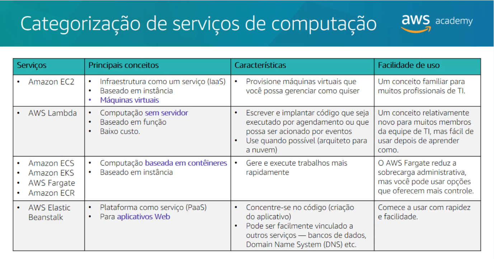
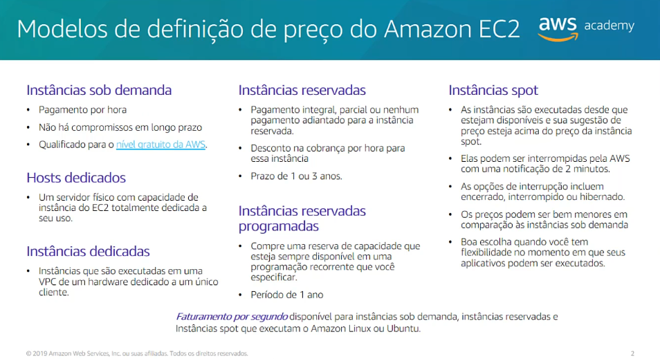

# Módulo 6

## Computação

### Seção 1 - Visão geral dos serviços de computação

  

### Seção 2 - Amazon EC2

A execução de servidores no local é cara: os servidores devem ser adquiridos, datacenters devem ser criados, instalados e mantidos. As organizações devem provisionar permanentemente hardware suficiente para lidar com picos de carga de trabalho. Depois que todo hardware estiver instalado, a capacidade do servidor geralmente fica ociosa para partes significativas de todos os dias, o que é um desperdício.

O **Amazon Elastic Compute Cloud (EC2)** fornece máquinas virtuais chamadas de instâncias do EC2 na nuvem, onde você pode hospedar as mesma aplicações que são utilizadas em sistemas 'on-premises'.  

- Você pode executar instâncias de qualquer tamanho em uma zona de disponibilidade em qualquer lugar do mundo.
  - Execute instâncias a partir de imagens de máquina da Amazon(AMIs)
- Você pode controlar o tráfego de e para instâncias usando **grupos de segurança**

Escolhas feitas usando o Assistente para executar instância:

- AMI: qual AMI executar  a instância do EC2
- Tipo de instância: determinará a RAM, CPU, armazenamento e performance de rede
- Configurações de rede
- Função do IAM
- Dados de usuário
- Opções de armazenamento
- Tags
- Grupo de segurança
- Par de chaves

### Seção 3 - Amazon EC2 Parte 2

Opções de armazenamento do Amazon EC2:

- Amazon Elastic Block Store (Amazon EBS)
  - Volumes de armazenamento em nível de bloco duráveis
  - Você pode interromper a instância e iniciá-la novamente; os dados ainda estarão lá
- Armazenamento de instâncias do Amazon EC2
  - O armazenamento é fornecido em discos anexados ao computador host em que a instância do EC2 está em execução
  - **Se a instância for interrompida, os dados armazenados aqui serão excluídos** 
- Outras opções de armazenamento (não para o volume raiz)
  - Monte um sistema de arquivos do Amazon Elastic File System (Amazon EFS)
  - Conecte-se ao Amazon Simple Storage Service (Amazon S3)

### Seção 4 - Amazon EC2 Parte 2

- Uma **tag** é um rótulo que você atribui a um recurso da AWS
  - Consiste um uma chave e um valor opcional
- A marcação é como você pode anexar metadados a uma instância do EC2
- Benefícios potenciais da marcação: filtragem, automação, alocação de custos e controle de acesso

- Um **grupo de segurança** é um conjunto de regras de firewall que controlam o tráfego para a instância
  - Ele existe fora do sistema operacional convidado da instância

- Na execução da instância, você especifica um **par de chaves** existente ou cria um novo par de chaves
- Um par de chaves consiste em:
  - Uma chave pública que a AWS armazena
  - Um arquivo de chave privada que você armazena
- Ele permite conexões seguras com a instância

### Seção 5 - Otimização de custos do Amazon EC2 

A Amazon oferece diferentes modelos de definição de preço para escolher quando você deseja executar instâncias do EC2.

	
  
  

- **Instâncias sob demanda**: baixo custo e flexibilidade
- **Instâncias spot**: carga de trabalho dinâmica e em grande escala
- **Instâncias reservadas**: a previsibilidade garante que a capacidade computacional esteja disponíveis quando necessário
- **Hosts dedicados**: economize dinheiro com custos de licenciamento. Ajude a cumprir os requisitos regulatórios e de conformidade 

**Casos de uso**:

- Instâncias sob demanda
  - Cargas de trabalho de curto prazo com picos ou imprevisíveis
  - Desenvolvimento ou teste de aplicativos
- Instâncias spot
  - Aplicações com horários de início e término flexíveis
  - Aplicações que são viáveis somente por preços computacionais muito baixos
  - Usuários com necessidades computacionais urgentes para grandes quantidades de capacidade adicional
- Instâncias  reservadas
  - Cargas de trabalho de uso constante ou previsível
  - Aplicativos que exigem capacidade reservada, incluindo recuperação de desastres
  - Os usuários podem fazer pagamentos prévios para reduzir ainda mais o total dos custos computacionais
- Hosts dedicados
  - Traga a sua própria licença (BYOL)
  - Conformidade e restrições normativas
  - Rastreamento de uso e licenciamento
  - Controlar posicionamento de instâncias

Os **quatro pilares da otimização de custos**:

- Tamanho certo
- Aumente a elasticidade
- Modelo de definição de preço ideal
- Otimizar opções de armazenamento

### Seção 6 - Serviços de Contêiner

**Noções básicas de contêiner**:

- Os contêineres são um método de virtualização do sistema operacional
- São menores que máquinas virtuais e não contém um sistema operacional inteiro

**Docker**:

- É uma plataforma de software que permite criar, testar e implantar aplicações rapidamente
- Você executa contêineres no Docker
  - Os contêineres são criados a partir de um modelo chamado imagem
- Um contêiner tem tudo o que é necessário para execução de um aplicativo
- Os contêineres têm tudo o que é necessário para execução do software:
  - Bibliotecas, Ferramentas do sistema, Código e Tempo de execução

**Amazon Elastic Container Service (Amazon ECS)**:

- Um serviço de gerenciamento de contêineres altamente escalável e rápidp
- Principais benefícios:
  - Orquestra a execução de contêineres do Docker
  - Mantém e escala a frota de nós que executam seus contêineres
  - Remove a complexidade da criação da infraestrutura
- Integrado a recursos:
  - Elastic Load Balancing
  - Grupos de segurança do Amazon EC2
  - Volumes do Amazon EBS
  - Funções do IAM

**Kubernetes**:

- É um software de código aberto para orquestração de contêineres
  - Implante e gerencie aplicativos usando contêineres em *grande escala*
  - O mesmo conjunto de ferramentas pode ser usado no local e na nuvem
- Complementa o Docker
  - O Docker permite que você execute vários contêineres em um único host do sistema operacional
  - O Kubernetes orquestra vários hosts de Docker (nós)
- Automatiza:
  - Provisionamento de contêineres
  - Redes
  - Distribuição de carga
  - Escalabilidade

**Amazon Elastic Kubernetes Service (Amazon EKS)**:

- Permite executar o Kubernetes na AWS
- Oferece suporte a contêineres Linux e Windows
- Compatível com as ferramentas de comunidade do Kubernetes e dá suporte a complementos populares do Kubernetes

Por que usar o  Amazon EKS?

- Gerenciar clusters de instâncias de computação do Amazon EC2
- Execute contêineres orquestrados pelo Kubernetes nessas instâncias

**Amazon Elastic Container Registry (Amazon ECR)**:

- É um registro de contêiner gerenciado do Docker que facilita o armazenamento, o gerenciamento e a implantação de imagens de contêineres do Docker

### Seção 7 - Introdução ao AWS Lambda

O AWS Lambda é um **serviço de computação sem servidor orientado a eventos**. Ele permite executar código sem provisionar ou gerenciar servidores. Você cria uma função do Lambda, que é um recurso da AWS que contém o código que você deseja executar. Em seguida, você define a função do Lambda para ser **acionada em uma programação ou em resposta a um evento**.

Você pode orquestrar várias funções do Lambda para tarefas complexas ou demoradas criando fluxos de trabalho com o **AWS Step Functions**. Com o Step Functions e o Lambda, é possível criar processos estáveis e de longa execução para aplicativos e back-ends.

**Fontes de eventos**:

- Amazon S3
- Amazon DynamoDB
- Amazon Simple Notification Service (Amazon SNS)
- Amazon Simple Queue Service (Amazon SQS)
- Amazon API Gateway
- Application Load Balancer
- Outras ...

### Seção 8 - Introdução ao AWS Elastic Beanstalk

É outra opção de serviço de computação da AWS. Ele oferece uma maneira fácil de colocar aplicativos web em execução na Nuvem AWS. Um serviço gerenciado que lida automaticamente com:

- Provisionamento e configuração da infraestrutura
- Implantação
- Balanceamento de carga
- Escalabilidade automática
- Monitoramento de integridade
- Análise e depuração
- Registro em log

Ele oferece suporte a aplicativos Web escritos para plataformas comuns. Lida automaticamente com a implantação, importando servidores como Apache, NGINX, Passenger, entre outros. A única coisa que você deve criar é seu código.

