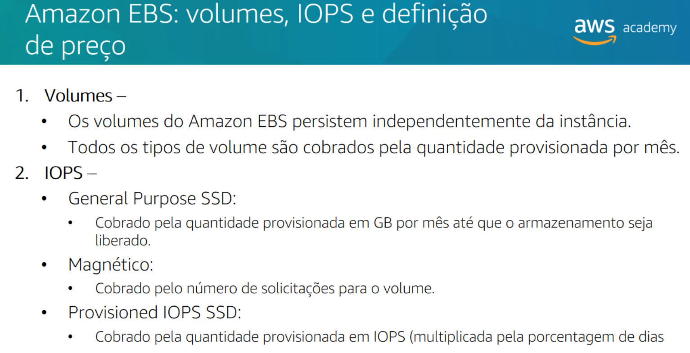
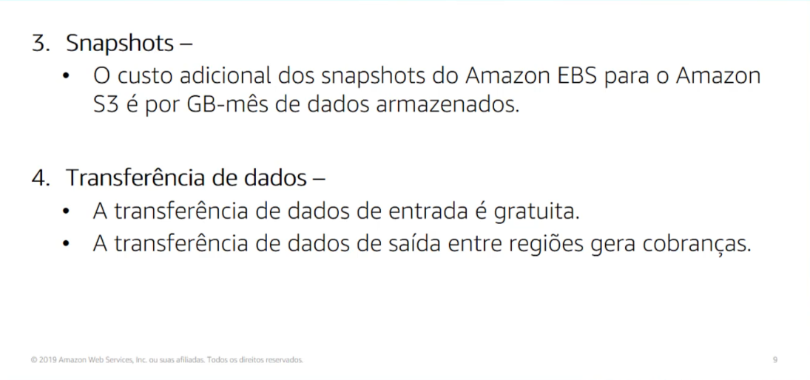
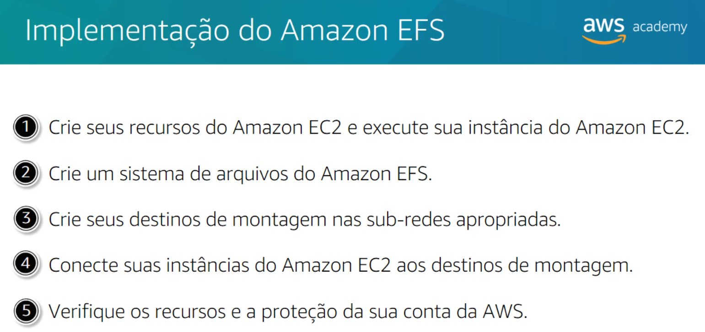
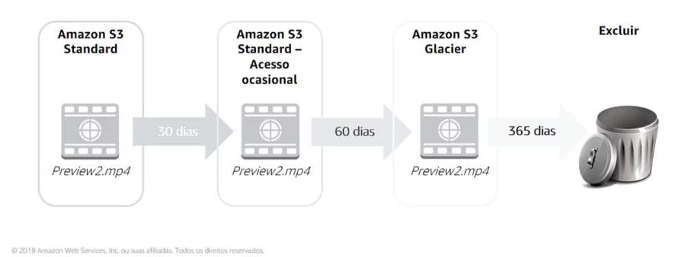

# Módulo 7

## Armazenamento

### Seção 1 - Amazon Elastic Block Store (Amazon EBS) 

Amazon EBS disponibiliza **volumes de armazenamento persistente em blocos para uso com instâncias do Amazon EC2**. Armazenamento persistente é qualquer dispositivo de armazenamento físico de dados que retém dados após a alimentação desse dispositivo ser desligada. Ele também é chamado de **armazenamento não volátil**.

Cada volume do Amazon EBS é replicado automaticamente dentro da sua zona de disponibilidade para proteger você contra falhas de componente. 

Opções de armazenamento da AWS: o que acontece se você quiser alterar um caractere em um arquivo de 1 GB?

- **Armazenamento em bloco**: alterar um bloco (parte do arquivo) que contém o caractere. Geralmente são mais rápidas e usam menos largura de banda. Mas podem custar mais do que o armazenamento no nível do objeto.
- **Armazenamento de objetos**: todo o arquivo deve estar atualizado

O Amazon EBS permite criar volumes de armazenamento individuais e anexá-los a uma instância do Amazon EC2:

- O Amazon EBS oferece armazenamento em nível de blocos
- Os volumes são replicados automaticamente dentro de sua zona de disponibilidade
- O backup pode ser feito automaticamente no Amazon S3 por meio de snapshots
  - O primeiro snapshot é chamado de '**baseline snapshot**'. Qualquer outro snapshot depois que a baseline, captura apenas o que é diferente do snapshot anterior. 
- Os usos incluem:
  - Volumes de inicialização e armazenamento para instâncias do Amazon EC2
  - Armazenamento de dados com um sistema de arquivos
  - Hosts de banco de dados
  - Aplicações empresariais

Para prover um nível ainda mais alto de durabilidade de dados, com o Amazon EBS você pode criar **snapshots** pontuais dos volumes e recriar um novo volume a partir de um snapshot a qualquer momento.

Também é possível compartilhar instantâneos ou até copiar esses instantâneos para diferentes regiões da AWS para uma proteção de recuperação de desastres ainda melhor.

Você também pode criptografar volumes do Amazon EBS sem custo adicional. É também possível aumentar a capacidade e mudar para diferentes tipos (elasticidade).

	
  
  

	
  
  

### Demonstração - demonstração do console do Amazon Elastic Block Store

**EBS representa o equivalente  a um HD para uma instância EC2**.  Implementa o que chamamos de armazenamento em bloco, porque uma vez que é formatada e montada e começamos à usar, a utilização acontece em blocos. Esses são os mesmos mecanismos usados em HDs normais.

### Laboratório 4 - Trabalhando com EBS

- Quando utilizadas como uma partição de inicialização, as instâncias do  Amazon EC2 podem ser interrompidas e posteriormente reiniciadas, permitindo que você pague somente pelos recursos de armazenamento utilizados, mantendo o estado de sua instância.
- Os volumes do Amazon EBS oferecem melhor durabilidade em comparação aos  armazenamentos locais de instâncias do Amazon EC2, porque os volumes do  Amazon EBS são automaticamente replicados no back-end (em uma única zona de disponibilidade).
- Para aqueles que desejam ainda maior durabilidade, o Amazon EBS fornece a capacidade de criar snapshots de momentos específicos de seus volumes,  sendo armazenados no Amazon Simple Storage Service (Amazon S3) e  automaticamente duplicados pelas várias zonas de disponibilidade.

Os volumes do Amazon EBS contam com os seguintes recursos:

- **Armazenamento persistente**: a vida útil do volume é independente de qualquer instância específica do Amazon EC2.
- **Uso geral**: os volumes do Amazon EBS são dispositivos de blocos brutos e não  formatados que podem ser usados em qualquer sistema operacional.
- **Alta performance**: os volumes do Amazon EBS são iguais ou melhores que as unidades locais do Amazon EC2.
- **Alta confiabilidade**: os volumes do Amazon EBS têm redundância integrada dentro de uma zona de disponibilidade.
- **Projetado para resiliência**: a AFR (taxa anual de falhas) do Amazon EBS está entre 0,1% e 1%.
- **Tamanho variável**: os tamanhos de volume variam de 1 GB a 16 TB.
- **Fácil de usar**: os volumes do Amazon EBS podem ser facilmente criados, associados, incluídos em backup, restaurados e excluídos.

### Seção 2 - Amazon Simple Storage Service (Amazon S3) 

O Amazon S3 é um armazenamento no nível do objeto, o que significa que, se você quiser alterar uma parte de um arquivo, deverá fazer a alteração e, em seguida fazer upload de todo o arquivo modificado. O S3 armazena dados como objetos em recursos que são chamados de buckets. O S3 é uma solução gerenciada de armazenamento na nuvem projetada para escalar de forma transparente e fornecer 11 noves de durabilidade.

O Amazon S3 oferece uma variedade de classes de armazenamento no nível do objeto projetadas para diferentes casos de uso:

- **Amazon S3 Standard**: projetado para oferecer alta disponibilidade, alta durabilidade e desempenho para dados acessados com frequência. **Viável para vários casos de uso, incluindo distribuição de conteúdo e análise de big data**.

  

- **Amazon S3 Intelligent Tiering**: foi projetada para otimizar custos **movendo automaticamente dados para o nível de acesso mais econômico**. Por uma pequena taxa mensal por objeto, o Amazon S3 monitora os padrões de acesso dos objetos no Amazon S3 Intelligent-Tiering e move os objetos que não foram acessados por 30 dias consecutivos para o nível de acesso infrequente. Se esse objeto for acessado, ele é movido automaticamente de volta para o nível de acesso padrão. Funciona bem para **dados de longa duração com padrões de acesso desconhecidos ou imprevisíveis**.

  

- **Amazon S3 Standard-Infrequent Access (Amazon S3 Standard-IA)**: é usada **para dados acessados com menos frequência, mas que exigem rapidez quando necessário**. Foi projetado para fornecer a alta durabilidade, alta taxa de transferência e a baixa latência do Amazon S3 Standard, com um preço baixo por GB de armazenamento e por GB de recuperação. B**om para armazenamento e backups de longo prazo, e é um datastore para arquivos de recuperação de desastres**.

  

- **Amazon S3 One Zone-Infrequent Access (Amazon S3 One Zone-IA)**: é **para dados acessados com menos frequência, mas que exigem acesso rápido quando necessário**. Ao contrário de outras classes de armazenamento, armazena dados em **uma única zona de disponibilidade**. E custa menos que o Amazon S3 Standard-Infrequent Access. Funciona bem para clientes que desejam uma opção de menor custo para dados acessados com pouca frequência, mas não exigem a disponibilidade e a resiliência do Amazon S3 Standard ou Amazon S3 Standard-Infrequent Access. É uma **boa opção para armazenar cópias de backup secundárias ou dados fáceis de recriar**.

  

- **Amazon S3 Glacier**: é um armazenamento seguro, durável e de baixo custo para arquivamento de dados. Para manter os custos baixos, mas com condições de suprir necessidades variáveis, o Amazon S3 Glacier disponibiliza **três opções de recuperação** que podem levar de alguns minutos a várias horas. 

  

- **Amazon S3 Glacier Deep Archive**: é a **categoria de armazenamento de menor custo**. Ele oferece suporte à retenção de longo prazo e à preservação digital para **dados que podem ser acessados uma ou duas vezes no ano**. Ele foi projetado para **setores altamente regulamentados**, como serviços financeiros, saúde e setores públicos. Também pode ser usado para **casos de uso de backup e recuperação de desastres**. Também foi projetado para fornecer 11 noves de durabilidade. Pelo menos três zonas de disponibilidade.

### Seção 3 - Amazon Elastic File System (Amazon EFS) 

O Amazon EFS implementa armazenamento para instâncias do EC2 que várias máquinas virtuais podem acessar ao mesmo tempo. Ele é implementado como um sistema de arquivos compartilhado que usa o Network File System. O Amazon EFS é um serviço gerenciado que facilita a configuração e o dimensionamento de armazenamento de arquivos na nuvem da AWS.

- Funciona bem para big data e análise, fluxos de trabalho de processamento de mídia, gerenciamento de conteúdo, serviço na web e diretórios iniciais
- Sistema de arquivos em escala de petabytes e baixa latência
- Armazenamento compartilhado
- Capacidade elástica
- Oferece suporte ao Network File System (NFS)
- Compatível com todas as AMIs baseadas em Linux para o Amazon EC2

Amazon EFS como armazenamento de arquivos na nuvem. Com ele, você pode criar um sistema de arquivos, montar o sistema de arquivos em uma instância do Amazon EC2, ler e gravar dados de/para seu sistema de arquivos. Você pode montar um sistema de arquivos do Amazon EFS em sua VPC.

	
  
  

### Seção 4 - Amazon S3 Glacier 

O Amazon S3 Glacier é um serviço de armazenamento na nuvem seguro, durável e de custo extremamente baixo para arquivamento de dados e backups de longo prazo. Ao usar o Glacier para arquivar dados, você pode armazenar seus dados a um custo extremamente baixo, mesmo em comparação com o Amazon S3. No entanto, você não pode recuperar seus dados imediatamente quando quiser. Os dados armazenados no Glacier podem levar várias horas para serem recuperados.

Um **arquivo** é qualquer objeto, como uma foto, um vídeo, um arquivo ou um documento que você armazena no Amazon S3 Glacier. É a unidade básica de armazenamento.

Um **cofre** é um contêiner para armazenar arquivos. Ao criar um cofre, você especifica o nome do cofre e a região onde deseja localizar o cofre.

**Opções de recuperação de dados:**

- Padrão: de 3 a 5 horas
- Em massa: de 5 a 12 horas
- Expressa: de 1 a 5 minutos

 As **políticas de ciclo de vida do Amazon S3** permitem que você exclua ou mova objetos com base na idade.

	
  
  

