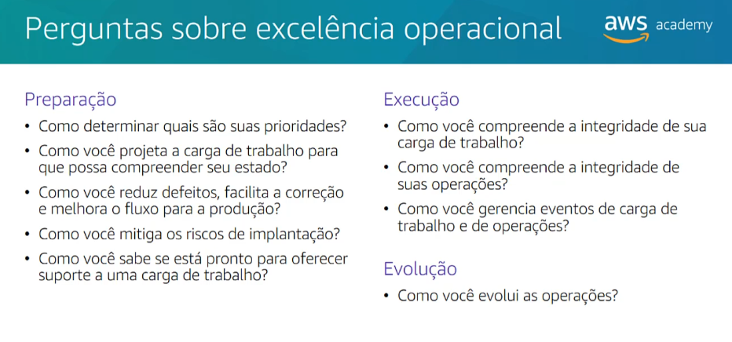
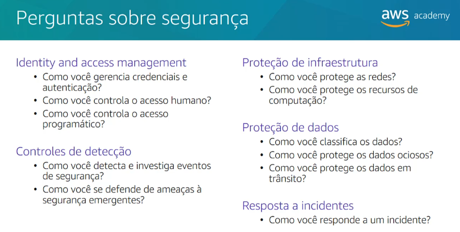
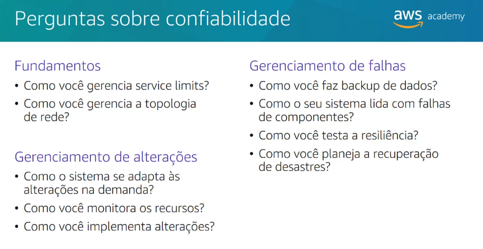
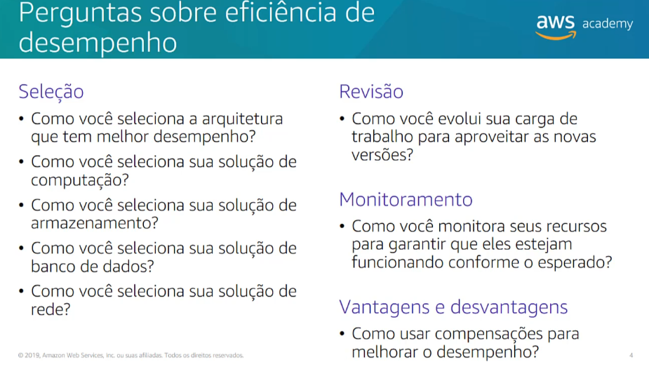
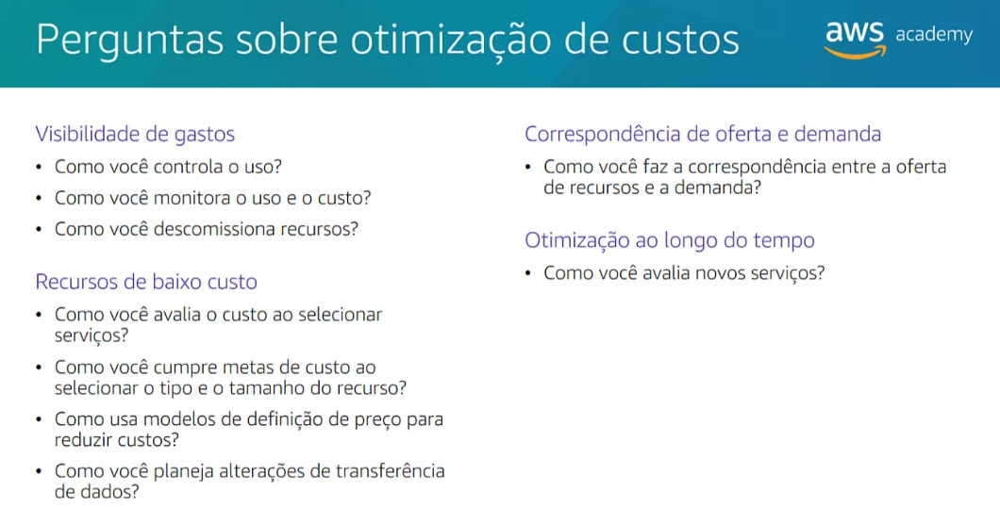
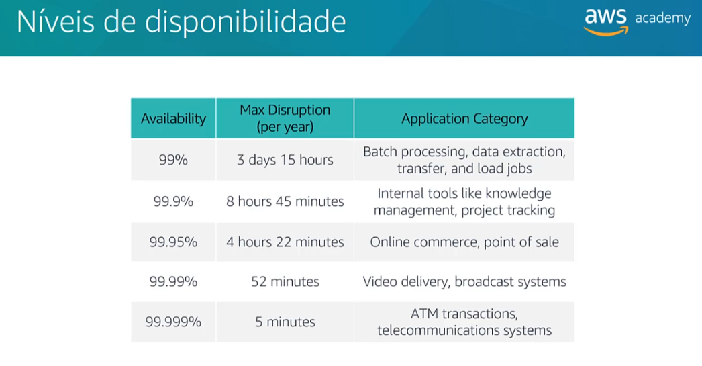

# Módulo 9

## Arquitetura de nuvem

### Seção 1 - AWS Well-Architected Framework 

Grandes sistemas exigem arquitetos para gerenciar seu tamanho e complexidade. Os arquitetos de nuvem interagem com os responsáveis pela tomada de decisões para identificar o objetivo comercial e os recursos que precisam ser aprimorados. Eles farantem o alinhamento entre os resultados de tecnologia de uma solução e os objetivos empresariais.

O AWS Well-Architected Framework é um guia projetado para ajudá-lo a criar a infraestrutura mais segura, de alto desempenho, resiliente e eficiente possível para seus aplicativos e cargas de trabalho de nuvem. Ele oferece um conjunto de perguntas fundamentais e as melhores práticas que podem ajudá-lo a avaliar e implementar suas arquiteturas de nuvem.

O AWS Well-Architected Framework está organizado em cinco pilares:

- Excelência operacional
- Segurança
- Confiabilidade
- Eficiência de desempenho
- Otimização de custos

### Seção 2 - Pilar Excelência operacional

Esse pilar se concentra na capacidade de executar e monitorar sistemas para agregar valor comercial e melhorar continuamente os processos e procedimentos de suporte.

Os principais tópicos:

- Gerenciar e automatizar alterações
- Responder a eventos
- Definir padrões para gerenciar com êxito as operações diárias

Existem seis princípios de design para a excelência operacional:

- Executar operações como código
- Anotar a documentação
- Fazer alterações frequentes, pequenas e reversíveis
- Refinar os procedimentos operacionais com frequência
- Prever falhas
- Aprender com eventos e falhas operacionais

  

### Seção 3 - Pilar Segurança

O pilar segurança enfoca a capacidade de proteger informações, sistemas e ativos, e ao mesmo tempo agregar valor comercial por meio de avaliações de risco e estratégias de mitigação.

Os principais tópicos:

- Identificar e gerenciar quem pode fazer o quê
- Estabelecimento de controles para detectar eventos de segurança
- Proteção de sistemas e serviços
- Confidencialidade e integridade dos dados

Existem sete princípios de design que podem melhorar a segurança:

- Implementar uma base de identidade sólida
- Habilitar a rastreabilidade
- Aplicar segurança em todas as camadas
- Automatizar as melhores práticas de segurança
- Proteger dados em trânsito e ociosos
- Manter as pessoas longe dos dados
- Preparar-se para eventos de segurança

  

### Seção 4 - Pilar Confiabilidade 

O pilar confiabilidade inclui a capacidade de um sistema se recuperar de interrupções de infraestrutura ou serviço, adquirir dinamicamente recursos computacionais para atender à demanda e mitigar interrupções, como configurações incorretas ou problemas temporários de rede.

Os principais tópicos:

- Configuração
- Requisitos entre projetos
- Planejamento de recuperação
- Tratamento de alterações

Existem cinco princípios de design que podem aumentar a confiabilidade:

- Testar procedimentos de recuperação
- Recuperar-se automaticamente de falhas
- Escale horizontalmente para aumentar a disponibilidade agregada do sistema
- Pare de tentar adivinhar a capacidade
- Gerenciar alterações na automação

  

### Seção 5 - Pilar Eficiência de desempenho

O pilar eficiência de performance prioriza a capacidade de usar os recursos de computação e TI de forma eficiente para atender aos requisitos do sistema e manter essa eficiência à medida que as mudanças na demanda e as tecnologias evoluem. 

Os principais tópicos:

- Seleção dos tipos e tamanhos certos de recursos com base nos requisitos de carga de trabalho
- Monitoramento e desempenho
- Tomar decisões embasadas para manter a eficiência à medida que as necessidades empresariais evoluem

Existem cinco princípios de design que podem melhorar a eficiência do desempenho:

- Democratizar tecnologias avançadas
- Tenha alcance global em minutos
- Usar arquiteturas sem servidor
- Experimentar com mais frequência
- Ter afinidade mecânica

  

### Seção 6 - Pilar Otimização de custos

O pilar otimização de custos se concentra na capacidade de executar sistemas para entregar valor comercial com o menor preço.

Principais tópicos:

- Compreender e controlar quando o dinheiro está sendo gasto
- Selecionar o número mais apropriado e correto de tipos de recursos
- Analisar gastos ao longo do tempo
- Escalabilidade para atender às necessidades empresariais sem gastos excessivos

Existem cinco princípios de design que podem melhorar a otimização de custos:

- Adotar um modelo de consumo
- Medir a eficiência geral
- Eliminar despesas em operações de datacenter
- Analisar e atribuir despesas
- Usar serviços gerenciados e em nível de aplicativo para reduzir custo de propriedade

  

### Seção 7 - Confiabilidade e disponibilidade

Há dois fatores importantes que os arquitetos de nuvem consideram ao projetar arquiteturas para suportar falhas: confiabilidade e disponibilidade.

**Confiabilidade** é uma medida da capacidade do sistema de fornecer funcionalidade quando desejado pelo usuário. Como "tudo falha o tempo todo" você deve pensar na confiabilidade em termos estatísticos. Confiabilidade é a probabilidade de que todo o sistema funcione como pretendido para um período especificado. O sistema inclui todos os componentes do sistema: hardware, firmware e software. Tempo médio entre falhas (MTBF) = tempo total em serviço / número de falhas.

**Disponibilidade** é a porcentagem de tempo em que um sistema está operando normalmente ou corretamente executando as operações dele ou o tempo de operação normal ao longo do tempo total. A disponibilidade é reduzida sempre que o aplicativo não está funcionando normalmente, incluindo interrupções programadas e não programadas.

**Alta disponibilidade**:

- O sistema pode suportar alguma medida de degradação e ainda permanecer disponível
- O tempo de inatividade é minimizado
- Necessidade mínima de intervenção humana

  

Fatores que influenciam a disponibilidade:

- **Tolerância a falhas**: a redundância integrada dos componentes de um aplicativo e sua capacidade de permanecer operacional
- **Escalabilidade**: a capacidade de um aplicativo acomodar aumentos nas necessidades de capacidade sem alterar o design
- **Capacidade de recuperação**: o processo, as políticas e os procedimentos relacionados ao serviço de restauração após um evento catastrófico

### Seção 8 - AWS Trusted Advisor

O AWS Trusted Advisor é uma ferramenta online que fornece orientações em tempo real para ajudar você a provisionar seus recursos de acordo com as melhores práticas da AWS. Ele examina todo o seu ambiente AWS e oferece recomendações em tempo real em cinco categorias.

- Otimização de custos
- Desempenho
- Segurança
- Tolerância a falhas
- Service Limits

